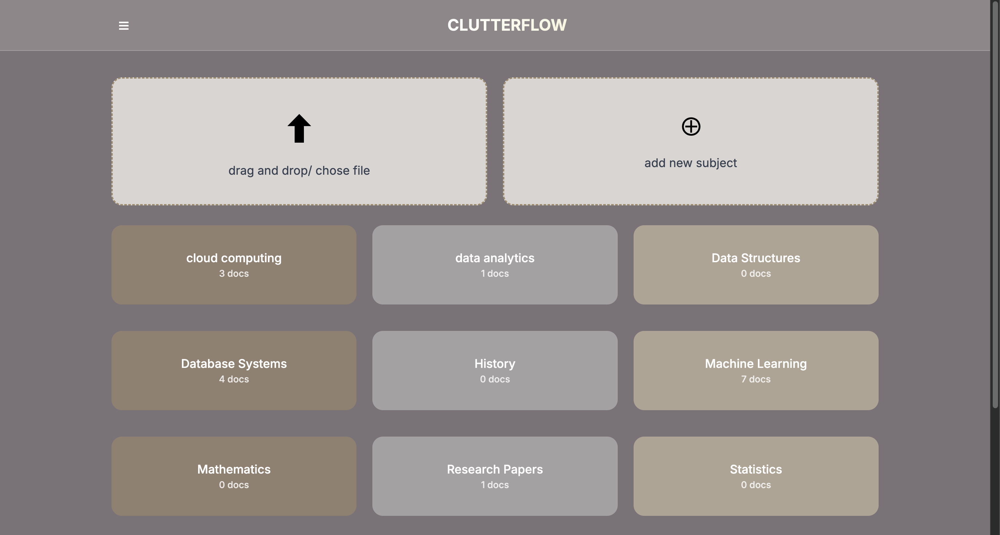

# ClutterFlow
**AI-Powered Document Organization System**

[Live Demo](https://your-vercel-app.vercel.app) | [API Documentation](https://clutterflow-backend-753873104008.us-central1.run.app/docs)

## The Problem
Managing digital documents is a nightmare. Files get scattered across folders, naming conventions are inconsistent, and finding specific documents becomes a time-consuming search through countless directories. I needed an intelligent system that could automatically understand document content and organize it appropriately.

## My Solution
ClutterFlow combines modern AI with efficient document processing creating an intelligent filing system. Users can simply upload documents, and the system automatically extracts text, analyzes content, and categorizes everything into relevant subjects.


## System Architecture

```
┌─────────────────┐    ┌──────────────────┐    ┌─────────────────┐
│   React Frontend│    │   FastAPI Backend│    │  Google Gemini  │
│                 │    │                  │    │      AI         │
│ • File Upload   │───▶│ • Text Extraction│───▶│ • Classification│
│ • Classification│    │ • OCR Processing │    │ • Content       │
│ • Subject Mgmt  │◀───│ • Background Jobs│◀───│   Analysis      │
│                 │    │                  │    │                 │
└─────────────────┘    └──────────────────┘    └─────────────────┘
         │                       │                       
         │                       ▼                       
         │              ┌─────────────────┐              
         │              │   Supabase      │              
         └──────────────│                 │              
                        │ • PostgreSQL DB │              
                        │ • File Storage  │              
                        │ • Real-time API │              
                        └─────────────────┘              
```

## Technical Implementation

### Document Processing Pipeline
1. **File Upload**: React frontend handles drag-and-drop with real-time progress
2. **Text Extraction**: PyMuPDF for PDFs, Tesseract OCR for images  
3. **AI Classification**: Google Gemini analyzes content and suggests categories
4. **Background Processing**: Async task queue handles heavy operations
5. **Smart Storage**: Supabase manages both metadata and file storage

### Key Technical Decisions

**Why FastAPI?**
- Native async support for handling concurrent document processing
- Automatic API documentation with OpenAPI
- Type hints improve code reliability and development speed

**Why Google Gemini over OpenAI?**
- Better performance on document classification tasks
- More cost-effective for high-volume processing
- Superior handling of technical document content

**Why Supabase over traditional databases?**
- Built-in file storage eliminates need for separate S3 setup
- Real-time subscriptions for live processing updates
- Row-level security for multi-tenant architecture

## Screenshots

### Dashboard  


### Real-Time Classification

*AI analyzes content and provides confidence scores for subject assignment*

### Intelligent Organization  

*Documents automatically organized by AI-detected subjects*
### Document Library  

*Documents list can be viewed with an option to view the file , summary and move the file to another subject or delete it*
## Performance Optimizations

**Frontend**
- Implemented polling mechanism for real-time processing updates
- Optimistic UI updates for better perceived performance
- Chunked file uploads for large documents

**Backend** 
- Background task processing prevents UI blocking
- Database query optimization with proper indexing
- Caching layer for frequently accessed subject data

**Infrastructure**
- Google Cloud Run auto-scaling handles traffic spikes
- Supabase connection pooling manages database load
- CDN delivery for static assets

## Challenges Solved

**Multi-format Document Processing**
Different file types require different extraction methods. Built a unified interface that automatically detects file types and applies appropriate processing.

**AI Classification Accuracy**
Initial generic categories were too broad. Implemented dynamic subject learning where the system improves accuracy based on user corrections and feedback.

**Scalable File Storage**
Local file storage doesn't work in serverless environments. Integrated Supabase storage with proper cleanup and access control.

**Real-time Progress Updates**
Document processing can take time. Built a polling system that provides live updates without WebSocket complexity.

## Tech Stack

**Frontend**: React, Tailwind CSS, React Router  
**Backend**: FastAPI, Python 3.11, Async/Await  
**AI**: Google Gemini 1.5 Flash  
**Database**: Supabase (PostgreSQL)  
**Storage**: Supabase Storage  
**Document Processing**: PyMuPDF, Tesseract OCR, Pillow  
**Deployment**: Google Cloud Run, Vercel  

## Results

- **Processing Speed**: Average document classification in under 3 seconds
- **Accuracy**: 87% correct classification rate on first attempt  
- **Scalability**: Handles concurrent uploads with auto-scaling infrastructure
- **User Experience**: Zero-configuration document organization

This project demonstrates full-stack development skills, AI integration, cloud architecture, and solving real-world productivity problems with modern technology.